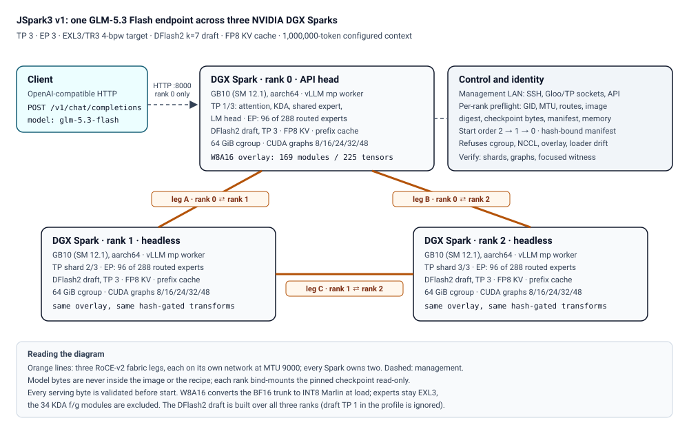

# JSpark3 v1

**JSpark3 turns three NVIDIA DGX Sparks into one OpenAI-compatible GLM-5.3
Flash endpoint, with a reproducible TP3 recipe and public benchmarks.**

> **Weights and licenses:** Brandon M. Music created the
> [ShapleyMcg](https://github.com/brandonmmusic-max/shapleymcg) quantization.
> Its license requires [attribution](#attribution) and includes
> a named exclusion. DFlash2 is a separate non-commercial dependency. Read
> the [license boundaries](#license) before serving.

## Results

| Measured result | JSpark3 v1 |
|---|---:|
| Paired single-stream code decode | **66.257 tok/s**, +7.27% |
| Paired single-stream structured decode | **81.962 tok/s**, +6.63% |
| Agent demonstration aggregate decode | **44.583 tok/s** |
| Configured context | **1,000,000 tokens** |

The paired rows compare the same recipe on the same three-Spark fleet with
the trunk overlay disabled, an unreleased internal control rather than a
market comparison. The agent run is product evidence, not a controlled
comparison. See the [machine-readable results](results/results.json) and
[benchmark methods and caveats](docs/BENCHMARKS.md).

## Prerequisites

- Three DGX Sparks with two RoCE-v2 interfaces each, cabled as a triangle with
  a management network and non-interactive SSH. Each direct leg needs its own
  IPv4 network at MTU 9000.
- Docker with the NVIDIA runtime, cgroup v2, and `rdma-core` on every Spark,
  plus at least 72 GiB of available host memory, 8 GiB of free work and model
  filesystem space, and about 180 GB for the model tree on each rank.
- A Linux or macOS controller with Python 3.9 or newer, `ssh`, `rsync`, and
  `sha256sum`.

## Quick start

From a fresh clone on the controller, copy the checked recipe to the same path
on every rank:

```bash
git clone --branch v1.0.0 https://github.com/jakejharris/jspark3.git
cd jspark3
(cd recipe && sha256sum -c SHA256SUMS)
for host in rank0 rank1 rank2; do
  rsync -a --delete recipe/ "$host":/srv/jspark3-recipe/
done
```

Next, stage the pinned image, checkpoints, FlyCockpit source, TP3 runtime
views, and fabric settings on every rank by following
[installation steps 3 through 5](docs/INSTALL.md#3-fetch-the-pinned-inputs-on-every-rank).
Those steps contain the required large downloads and host-specific interface
values. Then fill in the fleet values and run the fail-closed lifecycle:

```bash
cd recipe
cp .env.example .env
# Replace every placeholder in .env before continuing.
./scripts/clean-room-setup.sh --env-file .env --output preflight.json
preflight_sha=$(sha256sum preflight.json | cut -d' ' -f1)
./scripts/start.sh --env-file .env --preflight preflight.json \
  --preflight-sha256 "$preflight_sha" --confirm START-JSPARK3
./scripts/health.sh --env-file .env --manifest jspark3-release-manifest.json
./scripts/verify.sh --env-file .env --manifest jspark3-release-manifest.json \
  --output verify.json --log-output verify-rank0.log
```

The endpoint is OpenAI-compatible on rank 0, model name `glm-5.3-flash`,
thinking off by default and switchable per request. The full setup from bare
hosts is in [docs/INSTALL.md](docs/INSTALL.md).

## What JSpark3 is

JSpark3 v1 is a reproducible serving and runtime recipe. It runs the
EXL3/TR3 4-bpw GLM-5.3 Flash checkpoint with tensor parallel 3 and expert
parallel 3 over a two-leg RoCE-v2 triangle, adds a DFlash2 speculative draft,
an FP8 KV cache, prefix caching, a 1,000,000-token configured context, and a
selective INT8 (W8A16 Marlin) overlay for the model trunk that frees
1,595,392,320 bytes of weight memory per rank. A fail-closed lifecycle
controller refuses to start anything that differs from the measured
construction.

It is not a new model. The GitHub recipe and release assets contain no
checkpoint weight objects. The separate public Hugging Face repository carries
an attributed, byte-identical mirror of the pinned target checkpoint. All 123
allowlisted Git LFS payloads and the exact completion receipt were remotely
verified before maintainer merge into public main at
`e7c34dba923916754cfcb0bdf6c2c75a9b7ff1fc`. The recipe verifies every serving
byte and then builds the same runtime the evidence in this repository was
measured on.

> **License and weight provenance:** JSpark3's original recipe code and
> documentation are Apache-2.0. The Hugging Face weights are Brandon M.
> Music's exact EXL3/TR3 quantization, re-hosted byte-for-byte by Mia-AiLab
> and mirrored by JSpark3 without changing a weight byte. They remain under
> the attribution-required, source-available ShapleyMcg License v1.0,
> including its named exclusion; Z.AI's base model remains MIT. DFlash2 is
> not mirrored and remains a separate CC BY-NC-ND 4.0 dependency.

> **Release status: [v1.0.0](https://github.com/jakejharris/jspark3/releases/tag/v1.0.0), released 2026-09-02; attributed Hugging Face target mirror public.**
> The immutable terminal Hub main revision is
> [`e7c34dba923916754cfcb0bdf6c2c75a9b7ff1fc`](https://huggingface.co/jakejharris/jspark3/commit/e7c34dba923916754cfcb0bdf6c2c75a9b7ff1fc),
> with the verified receipt at
> [`huggingface/jspark3/MIRROR-COMPLETION.json`](huggingface/jspark3/MIRROR-COMPLETION.json).
> No JSpark3 GHCR image is published for v1.0.0; the release uses the exact
> upstream image by digest. See [RELEASE-GATE.md](RELEASE-GATE.md) for the
> terminal publication record.



## How it compares with what was already public

The question this release answers is what a DGX Spark owner could already get
publicly, and where this recipe sits beside that. The reference rows below are
**author-reported**: measured by each recipe's own author, on that author's
hardware, with that author's harness. The JSpark3 v1 row is our own local
measurement, and the Basis column states the conditions of every row.
**No percentage, delta, or ranking is computed between any two rows**, because
prompts, quantization lanes, speculation, context, clocking, safety envelope,
and estimators all differ. Read the rows as five separate measurements that
happen to share a page, not as a scoreboard.

| Recipe | Nodes | Lane | Context | Decode (tok/s) | Basis |
|---|---:|---|---:|---|---|
| **JSpark3 v1** `v1.0.0` | 3 | EXL3/TR3 4 bpw, DFlash2, W8A16 trunk overlay | 1,000,000 | structured count 81.962; code 66.257; prose 29.049 | local; frozen 24-request screen, thinking off, temperature 0, 400 max tokens, warm server; medians of three batteries; per-stream estimator |
| FlyCockpit TP3 `9093765c` | 3 | EXL3/TR3 4 bpw, DFlash2 | 1,000,000 | structured count 69.0 / 68.5 / 71.2; code 52.3 / 58.7 / 58.2 | author-reported |
| [neko-legends TP4](https://github.com/neko-legends/spark-bench/blob/a1d8daffad44ad69d8f9e27e621b5f4afc4157fe/README.md#L81-L188) | 4 | EXL3/TR3 4 bpw, DFlash2 | 1,000,000 | code 64.5; structured 100.9; math 77.8; prose 23.1; C4 aggregate 253 | author-reported; four DGX Sparks, warm client-wall [`bench_exl3.py`](https://github.com/neko-legends/spark-bench/blob/a1d8daffad44ad69d8f9e27e621b5f4afc4157fe/README.md#L140-L170), thinking off |
| Mia TP2 `c190db1a` | 2 | EXL3/TR3 4 bpw, DFlash2 | 1,000,000 | sparkDash C1 62.9; lab structured 65.1; lab prose 27.1 | author-reported |
| jetnet TP3 `bfc820ec` | 3 | NVFP4 with Marlin W4A16, MTP-4 | 512K | 35.2; DFlash2 lane, thinking on, 47.2 | author-reported |

Three of those recipes were also run on this fleet, each with its pinned
source and every adaptation listed. None is an exact reproduction and none
replays a source's own harness, so these are separate evidence, not a
restatement of the row above:

| Local reproduction | Fidelity | Nodes | Agent aggregate decode (tok/s) |
|---|---|---:|---:|
| `mia-tp2-historical-0e2e78f` | site/safety-adapted | 2 | 24.913 |
| `mia-tp2-current-c190db1a-adapted` | compatibility-adapted | 2 | 24.728 |
| `fly-derived-9093765c-adapted` | minimal-correctness/safety-adapted | 3 | 29.042 |

Those three are same-prompt agent runs with independent trajectories, so they
describe what each run did rather than which recipe is faster. Conditions,
minimum fields, sources, and caveats for every row above:
[docs/BENCHMARKS.md](docs/BENCHMARKS.md).

## What the overlay changed, internally

Separately from the public comparison, the project ran a matched A/B against
**the matched three-Spark control (same recipe, overlay disabled), an
unreleased internal development build**. That control is not a product, was
never published, and is not a market comparison; it is the only comparison
here where hardware, topology, checkpoint, draft, image, serving envelope,
workload, estimator, and safety contract are all matched, which makes the
overlay the intended variable.

In the strict same-day pairing the overlay was worth +7.27% on code, +6.63%
on structured count, and +8.35% on prose, with smoother token pacing (median
inter-token interval -6.83%, worst interval -59.29%) and +3.47% aggregate
service throughput at 48 concurrent streams.

Two things the same evidence says against the recipe, kept on purpose: the
three-stream wave (C3) was variable and lost its strict pairing (65.208 to
51.382 tok/s, -21.20%), the matched 113,908-token prefill proxy fell from
1277.443 to 1234.246 tok/s (-3.38%), and the measured build missed two
internal promotion gates: a campaign code-median floor of 67.0 tok/s by
0.743 tok/s (1.11%), and a sustained-pacing gate in the agent demonstration
(longest uncompensated slow run 14 against a limit below 5). Neither miss is
a correctness or stability failure; every request in every battery returned
complete, correct output with zero OOM, swap, restart, or throttle events.
Full tables, estimators, and receipts:
[docs/BENCHMARKS.md](docs/BENCHMARKS.md); everything not proven:
[docs/LIMITATIONS.md](docs/LIMITATIONS.md).

## What is in the box

| Path | What it is |
|---|---|
| [`recipe/`](recipe/README.md) | The runnable recipe: lifecycle controller, preflight, entrypoint, five hash-gated runtime transforms, the W8A16 overlay, checkpoint validation, `SHA256SUMS`. |
| [`docs/`](docs/ARCHITECTURE.md) | Architecture, technical report, benchmarks, install, operations, limitations, reproducibility, licensing. |
| [`results/`](results/SUMMARY.md) | Machine-readable results (`results.json`) and the sanitized evidence they derive from: batteries, matched controls, scheduler and prefill receipts, demonstration receipts, analyzer method. |
| [`manifests/`](manifests/dependencies.json) | Pinned dependencies, release metadata, the public-derivation record, and a CycloneDX SBOM. |
| [`huggingface/`](huggingface/README.md) | The Hugging Face repository metadata, results, licenses, provenance, target-mirror contract, and exact completion receipt; the verified target payload is public at the immutable terminal main revision. |
| [`docker/`](docker/README.md) | Local-only reproducibility definition for inspecting the labeled derivative; v1.0.0 publishes no JSpark3 container image and runs the upstream digest. |
| [`tools/`](tools/validate_release.py) | Release validator, release-asset and SBOM builders, and the pacing and stream analyzers used for the evidence. |
| [`release/`](release/RELEASE-NOTES.md) | Release notes and announcement drafts. |

## How it works, briefly

- **Topology.** Each Spark holds one TP shard of attention, the linear
  attention (KDA) blocks, the shared expert, and the LM head, plus 96 of the
  288 routed experts. Every node reaches each peer over its own RoCE-v2 leg at
  MTU 9000. Rank 0 serves the API.
- **Runtime adaptation.** vLLM inside the pinned image is adapted at container
  start by five transactional, hash-gated transform programs that reconstruct
  pinned upstream changes (TP3 head and vocabulary padding, DFlash2 KV
  slot-sharing, decode-floor scheduling, K-pool tail correction, KDA batching).
  Every touched file is checked before and after. Nothing is patched on disk
  outside the disposable container.
- **The overlay.** At load, 169 trunk modules (225 logical tensors) are
  converted from BF16 to INT8 Marlin with a 128, 64, 32 group ladder (K=704
  uses group 64). Routed experts stay EXL3; the 34 KDA f/g modules are
  excluded. The overlay module, its loader hook, and the loader's before and
  after hashes are pinned.
- **Fail-closed lifecycle.** Preflight rows are compared byte for byte against
  the expected row per rank; the start is bound to the preflight's checksum; a
  host-minted image receipt binds each container; the entrypoint refuses on
  cgroup, NCCL override, environment, receipt, or hash drift.

Design detail: [docs/ARCHITECTURE.md](docs/ARCHITECTURE.md). The full story,
including why each decision was made and what it cost:
[docs/TECHNICAL-REPORT.md](docs/TECHNICAL-REPORT.md).

## Pinned inputs

| Input | Identity |
|---|---|
| Target checkpoint | `Mia-AiLab/GLM-5.3-Flash-EXL3-TR3-4bpw` at `25a44fdbf16862a46b7cc9921142c6c81350af2f` (declared byte-identical to `brandonmusic/GLM-5.3-Flash-tr3-4bpw` at `5ab363a8dcf6405955fd5f99671e01a1c9fb124b`) |
| Draft checkpoint | `incoai/GLM-5.3-Flash-DFlash2` at `dc77ff1c99eeb2df044ee3d4f0094eb033fee410` |
| Serving image | `ghcr.io/miaai-lab/glm-5.3-flash-2x-dgx-sparks@sha256:9bb1557a4234fce63d59599e44d10747eabd742beb337eebf9e7070be8a0fd58` |
| Technique sources | FlyCockpit `9093765c757bd1976372196e44af84a67cf86bad`, vcruz305 `622cb878d66f703c597bd6baaa2423caa1786f99` |

Everything is listed with hashes in
[manifests/dependencies.json](manifests/dependencies.json) and
[manifests/sbom.cdx.json](manifests/sbom.cdx.json).

## Weights

The GitHub recipe and release assets contain no checkpoint weight objects. The
public Hugging Face release home carries the target checkpoint so that
operators can fetch it from one place: an exact, hash-verifiable copy of
`Mia-AiLab/GLM-5.3-Flash-EXL3-TR3-4bpw` at revision
`25a44fdbf16862a46b7cc9921142c6c81350af2f`, which is itself a byte-identical
re-host of `brandonmusic/GLM-5.3-Flash-tr3-4bpw` at
`5ab363a8dcf6405955fd5f99671e01a1c9fb124b`. Brandon M. Music is the
quantization author and Z.AI created the base model; JSpark3 trained nothing,
quantized nothing, and changes no weight byte.

Every file of that repository is listed with its size, SHA-256, and the way
that hash was obtained in
[`huggingface/jspark3/WEIGHTS-MANIFEST.json`](huggingface/jspark3/WEIGHTS-MANIFEST.json),
with the chain and one recorded upstream checksum discrepancy in
[`huggingface/jspark3/PROVENANCE.md`](huggingface/jspark3/PROVENANCE.md).
`tools/mirror_weights.py` fetches, verifies, and uploads it after a fresh
verification; its
upload path is a dry run by default. The DFlash2 draft is a separately pinned
dependency under its own license and is not mirrored.

> **Hub status: attributed target mirror public and remotely verified at immutable main revision [`e7c34dba923916754cfcb0bdf6c2c75a9b7ff1fc`](https://huggingface.co/jakejharris/jspark3/commit/e7c34dba923916754cfcb0bdf6c2c75a9b7ff1fc).**
> See [`huggingface/jspark3/MIRROR-COMPLETION.json`](huggingface/jspark3/MIRROR-COMPLETION.json),
> [`huggingface/jspark3/UPLOAD.md`](huggingface/jspark3/UPLOAD.md), and
> [RELEASE-GATE.md](RELEASE-GATE.md).

## Credits

JSpark3 v1 stands on work by others, all pinned and credited rather than
copied: Z.AI for GLM-5.3 Flash; Brandon M. Music and Mia-AiLab for the
ShapleyMcg EXL3/TR3 quantization; Inco AI for DFlash2 and z-lab for DFlash;
MiaAI-Lab for the two-Spark serving image and recipe; FlyCockpit for the
three-Spark TP3 lineage; vcruz305 for the K-pool tail correction; tonyd2wild
and sfxnz for scheduler and serving context; the vLLM and ExLlamaV3 projects.
See [THIRD_PARTY_NOTICES.md](THIRD_PARTY_NOTICES.md).

## License

Original code and prose in this repository are Apache-2.0
([LICENSE](LICENSE), [NOTICE](NOTICE)). That covers the recipe, tooling, and
documentation only. The target checkpoint is attribution-required under the
ShapleyMcg License v1.0, and the DFlash2 draft is CC BY-NC-ND 4.0 for research
and evaluation use with commercial use requiring permission from Inco AI. The
assembled endpoint is therefore neither unrestricted open source nor
commercial-ready. Details: [docs/LICENSING.md](docs/LICENSING.md).

## Attribution

This work includes or was produced using ShapleyMcg, created by Brandon M. Music (https://github.com/brandonmmusic-max/shapleymcg). ShapleyMcg is licensed under the ShapleyMcg License v1.0, an attribution-required license that grants no rights to the person known as "0xSero." Use of ShapleyMcg without this attribution is unlicensed.

## Citation

See [CITATION.cff](CITATION.cff) and [CITATION.bib](CITATION.bib). Cite the
upstream works alongside this recipe.
