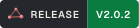
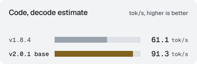
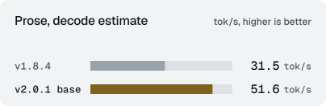
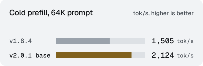
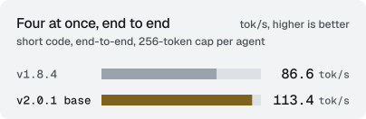

<p align="center">
  <a href="https://www.jakejh.com/jspark3/glm/">
    <picture>
      <source media="(max-width: 600px)" srcset="presentation/github/assets/hero-narrow.svg">
      
    </picture>
  </a>
</p>

<p align="center">A serving recipe for GLM-5.3 Flash on three NVIDIA DGX Sparks.</p>

<p align="center">
  <a href="https://github.com/jakejharris/jspark3/releases/tag/v2.0.2"></a>
  <a href="https://github.com/jakejharris/jspark3/blob/v2.0.2/INSTALL.md#what-you-need"></a>
  <a href="https://github.com/ashhart/TensorFold"></a>
  <a href="https://github.com/jakejharris/jspark3/blob/v2.0.2/INSTALL.md#quick-start-base-weights-the-default"></a>
  <br>
  <a href="LICENSE"></a>
  <a href="#weights"></a>
  <a href="#draft-model-license"></a>
</p>

<p align="center">
  <a href="https://github.com/jakejharris/jspark3/blob/v2.0.2/INSTALL.md"><b>Install</b></a> ·
  <a href="https://github.com/jakejharris/jspark3/releases/tag/v2.0.2">Release notes</a> ·
  <a href="https://github.com/jakejharris/jspark3/blob/v2.0.2/LIMITATIONS.md">Known issues</a> ·
  <a href="#rigmark">RigMark</a> ·
  <a href="#weights">Weights</a> ·
  <a href="https://github.com/jakejharris/jspark3/blob/v2.0.2/UPGRADING.md">Upgrading</a> ·
  <a href="#licenses">Licenses</a> ·
  <a href="#credits">Credits</a> ·
  <a href="https://www.jakejh.com/jspark3/glm/">Project page</a>
</p>

**Current release: JSpark3 v2.0.2 (GLM-5.3 Flash).** Start with the [v2.0.2 release](https://github.com/jakejharris/jspark3/releases/tag/v2.0.2) and the [v2.0.2 installation guide](https://github.com/jakejharris/jspark3/blob/v2.0.2/INSTALL.md).

> [!NOTE]
> Historical v2.0.1 install notes: see [known issues and hotfixes](docs/TROUBLESHOOTING.md#v201-known-issues-and-hotfixes) for startup rebuilds,
> possible compile locks, unavailable downloads and no-drafter preflight. The kernel rebuild hotfix is **validated on 3x DGX Spark (2026-10-04): retained boot reused the kernel cache; undo restored the original files**.

**JSpark3 v2.0.2 fixes image-history checkpoint reuse and adds GIF frame-zero support.**

Live 8/9/10-image resumes were 0 -> 68 -> 174 tokens, both nonzero hits from disk; GIF passed and smoke passed 6/6. Acceptance waited for durable checkpoints; continuous traffic can still skip optional disk saves.

The live image-cache acceptance passed on the prepared runtime. A clean installation of the final v2.0.2 public recipe has not been demonstrated; the installation and performance receipts remain v2.0.1 evidence. No new speed measurements are claimed. See the [live evidence](https://github.com/jakejharris/jspark3/blob/v2.0.2/release/v2.0.2/ROOTCAUSE.md).

RigMark, v2.0.1 with base weights + draft model (tok/s, higher is better):

<p align="center">
  <a href="#rigmark"><picture><source media="(prefers-color-scheme: dark)" srcset="presentation/github/assets/rigmark-code-dark.svg"></picture></a>
  <a href="#rigmark"><picture><source media="(prefers-color-scheme: dark)" srcset="presentation/github/assets/rigmark-prose-dark.svg"></picture></a>
  <a href="#rigmark"><picture><source media="(prefers-color-scheme: dark)" srcset="presentation/github/assets/rigmark-prefill-dark.svg"></picture></a>
  <a href="#rigmark"><picture><source media="(prefers-color-scheme: dark)" srcset="presentation/github/assets/rigmark-four-dark.svg"></picture></a>
</p>

<details>
<summary>The same figures as a table</summary>

| RigMark row | v1.8.4 | v2.0.1 |
|---|---:|---:|
| Code, decode estimate | 61.1 | **91.3** |
| Prose, decode estimate | 31.5 | **51.6** |
| Cold prefill, 64K prompt | 1,505 | **2,124** |
| Four at once, end to end (short code, end-to-end, 256-token cap per agent) | 86.6 | **113.4** |

</details>

Appliance comparison: different model IDs, not a same-weights claim. v1.8.4 ran with reasoning off, its default; v2.0.1 ran at reasoning effort low. Cold prefill and replay rows use raw token-ID completions, where reasoning effort does not apply. With base weights, v1.8.4 shows the first visible text sooner in two measured cases (about 2% on single-client short code replies, about 0.10 s on prose); both rows are in the RigMark section below.

- **80.9 tok/s** decode on one stream on our own benchmark (short code replies).
- **97.5 tok/s** aggregate decode on our own benchmark (short prompts, 41-62 tokens, 4 concurrent).
- **1.5 s** to first visible text when you continue a conversation of at least 100,000 tokens that had been pushed out of memory, against 49.9 s to read it from scratch (see known issue 17).
- **Images in chat:** up to 16 per request, as inline `data:` URLs.
- **Two weight variants, one switch:** MIT base weights by default, or opt-in refusal-removed (ablit) weights.

All figures above: base weights + draft model unless marked. The full RigMark table is below; every result set, with its conditions, is in the [v2.0.1 release notes](https://github.com/jakejharris/jspark3/releases/tag/v2.0.1).

v2.0.1 replaces the vLLM engine of v1.8.x with [a fork of TensorFold 0.3.6.2 (MIT)](https://github.com/ashhart/TensorFold), and serves public 4-bit GLM-5.3 Flash weights that the installer downloads, verifies against pinned hashes and splits across your three Sparks. v2.0.1 also saves conversation state to each Spark's disk by default: with base weights and the draft model, a conversation of at least 100,000 tokens that had been pushed out of memory showed its first visible text 1.5 s after it was continued, against 49.9 s to read it from scratch (see known issue 17).

**What you need:** three NVIDIA DGX Sparks, connected by a direct high-speed (RDMA) link. Cable the boxes' ConnectX-7 ports in a ring (rank 0 to rank 1, rank 1 to rank 2, rank 2 to rank 0), with each port up, RDMA working and MTU 9000; tensors travel over these cables. Every box also needs a shared LAN on which it can reach rank 0. The engine uses that LAN only to coordinate startup; tensor traffic stays on the cables. Follow the [v2.0.2 installation guide](https://github.com/jakejharris/jspark3/blob/v2.0.2/INSTALL.md) for the current procedure. For v2.0.1, the download, build and splitting steps were run from public sources on a Spark that had never run this project, and that packaged release was started and checked on three Sparks.

**Disk on each Spark**, by component:

- Container image: about 25 GB
- Wheels and engine build: under 50 MB
- Download: 181,741,759,037 bytes (181.7 GB; 54 files) for the weights; with the 2,342,460,697-byte draft model the download is 184,084,219,734 bytes (184.1 GB)
- Split weights: 63.9 GB for the first third, 62.8 GB for each of the other two
- Kernel cache: about 45 MB per host
- Session cache: up to 64 GiB, written only while 150 GiB stays free
- After splitting: the full download ($DATA/base/weights) is not needed to serve, so you may delete it.

> [!WARNING]
> **Before you connect a client:** The server listens on loopback (127.0.0.1) only, with no authentication and no CORS. Reach it through an SSH tunnel or a reverse proxy that adds authentication; don't expose the port.

## RigMark

v2.0.1 on RigMark, against our own v1.8.4 as the baseline, with one column per v2.0.1 weight variant.

Appliance comparison: different model IDs, not a same-weights claim. v1.8.4 ran with reasoning off, its default; v2.0.1 ran at reasoning effort low. Cold prefill and replay rows use raw token-ID completions, where reasoning effort does not apply.

| RigMark row | v1.8.4 | base weights + draft model · base profile | refusal-removed (ablit) weights + draft model · ablit profile |
|---|---:|---:|---:|
| Code, decode estimate (tok/s, higher is better) | 61.1 | 91.3 | 90.1 |
| Prose, decode estimate (tok/s, higher is better) | 31.5 | 51.6 | 50.8 |
| Structured output ceiling* (tok/s, higher is better) | 95.4 | 127.9 | 127.4 |
| Cold prefill, 64K prompt (tok/s, higher is better) | 1,505 | 2,124 | 2,129 |
| Four at once, end to end (tok/s, higher is better): short code, end-to-end, 256-token cap per agent | 86.6 | 113.4 | 128.4 |
| C1 per-stream time to first token, seconds (lower is better) | 0.396 | 0.405 | 0.361 |
| Prose time to first visible text, seconds (lower is better) | 0.380 | 0.484 | 0.497 |

\* predictable-output ceiling; not a proxy for agent speed

*C1 per-stream time to first token:* With base weights, v1.8.4 is about 2% faster on this row. The first token is visible text in every reply in each column.

*Prose time to first visible text:* With base weights, v1.8.4 shows prose text about 0.10 s sooner; v2.0.1 takes about 1.27x as long. RigMark's own prose time to first token marks the first reasoning token, not visible text, so it is not shown.

Prose row: at reasoning effort low, v2.0.1 writes a short reasoning passage before the visible text (with base weights, 11 to 12 tokens, about 1% of each reply of about 1,000 tokens); v1.8.4, with reasoning off, wrote none. RigMark counts those tokens in the prose decode rate and in last output time.

Both raw RigMark blocks, one per weight variant, are in the [v2.0.1 release notes](https://github.com/jakejharris/jspark3/releases/tag/v2.0.1).

## Results

With base weights and the draft model, eight concurrent requests produced 126.0 tok/s in total on short prompts of 41 to 62 tokens. With refusal-removed (ablit) weights and the draft model, eight concurrent requests on the same short prompts (41 to 62 tokens) produced 121.7 tok/s in total.

Every result set, with its conditions, is in the [v2.0.1 release notes](https://github.com/jakejharris/jspark3/releases/tag/v2.0.1).

## Weights

The installer offers two weight variants. The default is `base` (base weights). Choose the variant with `WEIGHTS=ablit` in `cluster.env`, or `--weights ablit` on fetch-weights.sh, split.sh and serve.sh (default `base`).

**`base`**: GLM-5.3 Flash in 4-bit MLX format, with the model's own multi-token prediction head, from [`TensorFold/GLM-5.3-Flash-MLX-4bit-MTP`](https://huggingface.co/TensorFold/GLM-5.3-Flash-MLX-4bit-MTP/tree/76add2a341a1cd90ad0e86bb69839ea9c35827c6) at revision `76add2a341a1cd90ad0e86bb69839ea9c35827c6` (MIT; formerly `Vontra/GLM-5.3-Flash-MLX-4bit-MTP`, which redirects). The installer downloads them at the pinned revision, verifies every file against a pinned SHA-256 list, and splits them into three per-host parts, checked against a shipped manifest. This project hosts none of the v2.0.1 weights. Download size: 181,741,759,037 bytes (181.7 GB; 54 files) for the weights; with the 2,342,460,697-byte draft model the download is 184,084,219,734 bytes (184.1 GB).

**`ablit`**: refusal-removed (abliterated) weights from [`orcarouter/GLM-5.3-Flash-Uncensored-MLX`](https://huggingface.co/orcarouter/GLM-5.3-Flash-Uncensored-MLX), an opt-in install for ablit development, red-teaming and refusal research. License: MIT (Copyright (c) 2026 Z.AI Co., Ltd), plus the use conditions on the source model card, quoted below. The installer downloads them with your own token at the pinned revision and converts them on your machine. Ready in this release: `scripts/fetch-weights.sh --weights ablit` downloads the source with your own token, `scripts/convert-ablit.sh` converts it and writes the three per-host parts, and `manifests/ablit/` checks a third you already have. We ran the shipped conversion on one DGX Spark, and its output matched these manifests file for file. On your own machine, `scripts/convert-ablit.sh` runs the pinned conversion scripts in `scripts/ablit/` inside the release's pinned container image, with no network and no GPU, then writes and checks the three per-host parts. The pinned base weights, TensorFold/GLM-5.3-Flash-MLX-4bit-MTP at revision 76add2a341a1cd90ad0e86bb69839ea9c35827c6 (MIT), supply the four-bit tensor layout and the native prediction layer that the conversion restores. The chat template is the base checkpoint's MIT template plus six lines added by this recipe, also under MIT; its reconstructed bytes are hash-checked. Measured on one DGX Spark: the 200.1 GB source download took about an hour on our connection. Converting, splitting and checking then took about 26 minutes of processing, used no GPU and under 4 GiB of process memory, and needed about 371 GB of free disk beyond the downloaded source (about 571 GB in all), on top of the base weights you already installed. `scripts/convert-ablit.sh` checks for about 400 GB free before it starts. To use it:

1. Sign in to a Hugging Face account.
2. Open [the source page](https://huggingface.co/orcarouter/GLM-5.3-Flash-Uncensored-MLX) and accept its terms yourself.
3. Give the installer your own token in `HF_TOKEN`.

The source's model card sets these conditions, quoted verbatim:

> - It is released **strictly for legitimate research** — interpretability, AI-safety and refusal-mechanism study, red-teaming, robustness evaluation, and controlled experiments.
> - **You assume full responsibility and liability** for how you use it and for everything it generates. Do not deploy it to end users or in production without adding your own safety, moderation, and abuse-prevention layers.
>
> By downloading or using this model you acknowledge and accept the above.

You are responsible for complying with the source model's terms and for how you use this model and what it generates. JSpark3 provides conversion tooling only; it hosts none of these weights and does not endorse any use of them.

Results for both variants, and for the base weights without the draft model, are in the [release notes](https://github.com/jakejharris/jspark3/releases/tag/v2.0.1).

## Draft model license

> [!IMPORTANT]
> The default draft model, Inco AI's [DFlash2](https://huggingface.co/incoai/GLM-5.3-Flash-DFlash2), is CC BY-NC-ND 4.0: non-commercial research and evaluation use only. The installer downloads it unmodified from Inco AI; this project never redistributes it. For commercial use, run the base weights without the draft model: start with `scripts/serve.sh --drafter none` on all three hosts (or set `DRAFTER=none` in `cluster.env`), and the model drafts with its own multi-token prediction head. That path runs MIT weights on a permissively licensed engine (MIT, with some Apache-2.0 code) and an Apache-2.0 recipe, inside NVIDIA's container under NVIDIA's terms. On the base weights, the draft model is the only non-commercial component.

For installation and the required `--drafter none` serving preflight, follow
[Running without the draft model](https://github.com/jakejharris/jspark3/blob/v2.0.2/INSTALL.md#running-without-the-draft-model).

## Upgrade and rollback

From v2.0.1, use a separate checkout and session namespace. **All three ranks must run the same release.**
Follow the [v2.0.2 upgrade and rollback guide](https://github.com/jakejharris/jspark3/blob/v2.0.2/UPGRADING.md). Keep v2.0.1 for rollback.

### Historical v2.0.1 upgrade notes

v2.0.1 is a new installation, not an in-place upgrade. The engine changes from vLLM to a fork of TensorFold 0.3.6.2 (MIT), and the weights change from the v1.8.x EXL3 files to public 4-bit MLX-format weights split across the three hosts. Stop v1.8.x before you start v2.0.1, and keep your v1.8.4 checkout and weights if you might roll back.

Reasoning is now always on. v1.8.4 had it off by default and honoured requests to turn it off; v2.0.1 runs a request with no reasoning setting at High and treats a request to turn it off as low (known issue 9). Replies begin with a reasoning passage, returned as `reasoning_content`, before the visible text, and it uses part of `max_tokens`.

v1.8.4 stays available; see rolling back. With base weights, two measured cases favour it (three DGX Sparks; v1.8.4 at its default, reasoning off, and v2.0.1 at reasoning effort low; an appliance comparison with different model IDs, not a same-weights claim). On prose replies, v1.8.4 shows the first visible text about 0.1 s sooner, because v2.0.1 writes a short reasoning passage first (known issue 9). With base weights and a single client on short code replies, the first visible text arrives in about the same time, with v1.8.4 about 2% faster. If you keep very many idle keep-alive clients connected, read known issue 13 first; that fix is outside v2.0.2; no target version is assigned.

To roll back, stop v2.0.1 and start v1.8.4 from its tag, following its own installation guide. v1.8.4 is the documented rollback.

In your v1.8.4 checkout:

```bash
git fetch --tags && git checkout v1.8.4
```

Or from a fresh clone:

```bash
git clone --branch v1.8.4 https://github.com/jakejharris/jspark3.git jspark3-v1.8.4
```

v1.8.4's installation guide downloads its weights from `Mia-AiLab/GLM-5.3-Flash-EXL3-TR3-4bpw`, which is no longer public. If you kept your v1.8.4 weights, use them. Otherwise, fetch the same weight and config files, with the hashes v1.8.4 checks, from the JSpark3 Hugging Face repository, [`jakejharris/jspark3` at revision `e6cb0b09`](https://huggingface.co/jakejharris/jspark3/tree/e6cb0b09b3bf9f2ce35721426c570c8e714c5fc4), which carries v1.8.4's own checksum list. In step 4 of the v1.8.4 guide, run this in place of the `hf download Mia-AiLab/...` command. Keep the directory name: v1.8.4's scripts expect it.

```sh
export HF_HUB_DISABLE_XET=1
hf download jakejharris/jspark3 \
  --revision e6cb0b09b3bf9f2ce35721426c570c8e714c5fc4 \
  --local-dir "$JSPARK_MODEL_ROOT/Mia-AiLab--GLM-5.3-Flash-EXL3-TR3-4bpw-25a44fdb"
sha256sum "$JSPARK_MODEL_ROOT/Mia-AiLab--GLM-5.3-Flash-EXL3-TR3-4bpw-25a44fdb/SHA256SUMS"
# expected: cb0da1f97a53aebc3fbc5478f19c82b25586b0bf8533c99fb4ed5321a48f5342
```

Use that revision, not `main`: later revisions changed the card and the checksum list. Then continue with the guide as written: its `validate_checkpoint.py` hashes every file against that list and must report `"serving_checkpoint_pass": true`. The v1.8.4 tag, recipe and guide stay unchanged.

See [upgrade and rollback](UPGRADING.md).

## Releases

- <a href="#releases"></a> **v2.0.2**: image checkpoint and GIF fixes. [release](https://github.com/jakejharris/jspark3/releases/tag/v2.0.2) · [installation guide](https://github.com/jakejharris/jspark3/blob/v2.0.2/INSTALL.md)
- **v2.0.1**: previous; the engine is a fork of TensorFold 0.3.6.2 (MIT). [release](https://github.com/jakejharris/jspark3/releases/tag/v2.0.1) · [installation guide](INSTALL.md)
- <a href="#releases"></a> **v1.8.4** (previous, vLLM): the documented rollback. [release](https://github.com/jakejharris/jspark3/releases/tag/v1.8.4) · [installation guide](https://github.com/jakejharris/jspark3/blob/v1.8.4/docs/INSTALL.md) · [required download-source correction](UPGRADING.md#going-back-to-v184)
- <a href="#releases"></a> v2.0.0: internal build, not published.
- <a href="#releases"></a> v1.8.0: do not install. It requires a container image that was never published.
- <a href="#releases"></a> v1.1.0 (Cadence): [historical guide](https://github.com/jakejharris/jspark3/blob/v1.1.0/README.md)

The runnable recipe files on this default branch are the frozen v1.1.0 export; the current v2.0.2 recipe and its guides live at the v2.0.2 tag. The maintained v2.0.1 notes are historical. Each release since v1.8.0 lives on its own tag, so install the recipe from a tag, following the maintained guides.

JSpark3 Tempo, a separate named release for DeepSeek-V4.1 Flash with its own version numbers, lives in [jspark3-deepseek](https://github.com/jakejharris/jspark3-deepseek).

## Licenses

Recipe files are Apache-2.0. The engine (`engine/`) is MIT: a fork of TensorFold 0.3.6.2 (MIT). It includes third-party code under its own permissive licenses (MIT and Apache-2.0), listed in its THIRD_PARTY_NOTICES, and two lines ported from upstream TensorFold that stay Apache-2.0, credited in its NOTICE. The base weights are MIT. The refusal-removed weights are MIT plus their source card's use conditions. The chat template is Z.AI's MIT template plus six lines added by this recipe, also under MIT. The draft model is CC BY-NC-ND 4.0 (non-commercial); it is downloaded at install and never redistributed here. The NVIDIA container image is pulled from NGC under NVIDIA's terms. See the [licensing guide](https://github.com/jakejharris/jspark3/blob/v2.0.1/NOTICE) and the [third-party notices](https://github.com/jakejharris/jspark3/blob/v2.0.1/THIRD_PARTY_NOTICES.md).

## Credits

v2.0.1 builds on work by:

- Z.AI (GLM-5.3 Flash, the base model, and its chat template)
- Hugging Face and the transformers contributors (the GLM-5.3 Flash model code the engine's CUDA path implements)
- Vontra, now TensorFold on Hugging Face (the 4-bit MLX base weights)
- Ash Hart and the TensorFold contributors (TensorFold 0.3.6.2, the engine release this project forks; DFlash ring-snapshot follow-up 47bf822)
- Taus Soe (GLM multi-stream foundation 20dbaba, disk-chain foundation b8a555a/bb16122 and CUDA image input 19680d9, via taussoe/TensorFold)
- FlyCockpit (zero-padding dimensions for three-way splitting, credited since v1.0.0)
- BTCXoomer (reporting the three-Spark NCCL subnet-routing requirement, credited in v1.1.0)
- Inco AI (the DFlash2 draft model)
- orcarouter (the refusal-removed source weights)
- z-lab (DFlash)
- MiaAI-Lab (upstream TensorFold: follower doorbell 358875c, DFlash ring 7c088eb, prefill row-blocking b23c10a and typed-parser hunk fe2b514)
- mikolaj92 (sparse-attention pool optimizations: skipping invisible pool tiles and bounding radix selection to visible pools, via upstream TensorFold commits b3b8a39 and f119334)
- Dorian (an upstream TensorFold server fix, ported)
- turboderp (ExLlamaV3's EXL3 format, which the engine's own decoders read)
- QTIP and QuIP# authors (trellis and incoherence-processing foundations used through ExLlamaV3's EXL3 format)
- Apple (MLX)
- Google DeepMind (Gemma 4, supported by the vendored engine's MLX backend)
- Prince Canuma and the mlx-vlm contributors (GLM-5.3 Flash code the engine follows and ports)

The [third-party notices](https://github.com/jakejharris/jspark3/blob/main/THIRD_PARTY_NOTICES.md) are the complete record: every third-party component of v2.0.1, its authors and its license (credits corrected 2026-10-03; the v2.0.1 tag's copy predates this).

v1.8.x credits, including Brandon M. Music's EXL3/TR3 checkpoint, are in the [v1.8.4 third-party notices](https://github.com/jakejharris/jspark3/blob/v1.8.4/THIRD_PARTY_NOTICES.md).

The [ShapleyMcg](https://huggingface.co/brandonmusic/GLM-5.3-Flash-tr3-4bpw) attribution is reproduced below.

This work includes or was produced using ShapleyMcg, created by Brandon M. Music (https://github.com/brandonmmusic-max/shapleymcg). ShapleyMcg is licensed under the ShapleyMcg License v1.0, an attribution-required license that grants no rights to the person known as "0xSero." Use of ShapleyMcg without this attribution is unlicensed.

<br>

<p align="center">
  <a href="https://www.jakejh.com/jspark3/glm/"><picture><source media="(prefers-reduced-motion: reduce)" srcset="presentation/github/assets/mark-still.svg"></picture></a>
</p>
