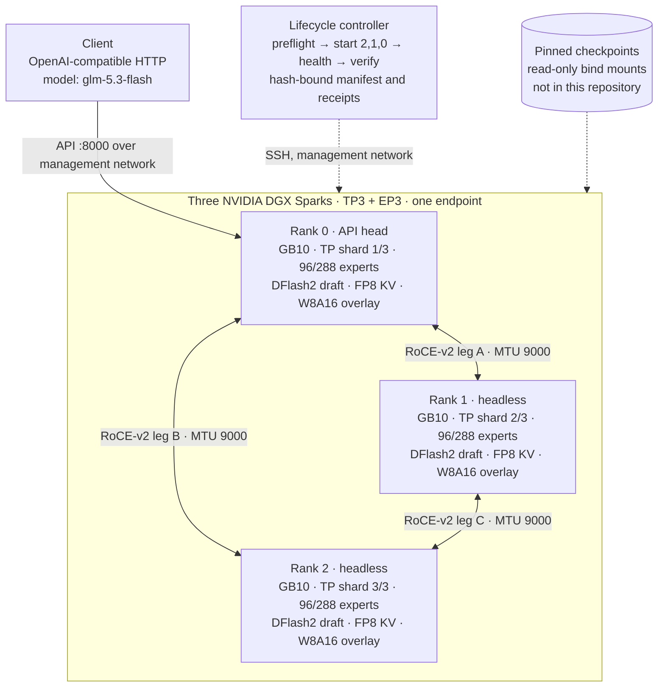

# Architecture

JSpark3 v1 turns three NVIDIA DGX Sparks into one GLM-5.3 Flash endpoint.
This page describes the pieces and how they hold together. The reasoning
behind each choice is in [TECHNICAL-REPORT.md](TECHNICAL-REPORT.md).



A static rendering is at [diagrams/architecture.svg](diagrams/architecture.svg).

## Hardware and fabric

- Three DGX Sparks, one GB10 (SM 12.1) each, aarch64.
- Two RoCE-v2 interfaces per Spark. The six fabric addresses form a
  three-edge pairwise triangle: each pair of nodes shares one direct leg on
  its own IPv4 network at MTU 9000. NCCL is pinned to IB transport with
  subnet-aware routing, cross-NIC disabled, NIC merging disabled, one common
  RoCE-v2 IPv4 GID index on all six HCAs, and no protocol, algorithm, or
  address-range override.
- A management network carries SSH, the API, and the Gloo and TP sockets.

## Model placement

GLM-5.3 Flash is a mixture-of-experts model with dense attention, linear
attention (KDA) blocks, a shared expert, and 288 routed experts. With TP 3
and EP 3:

- Attention, KDA, the shared expert, the dense MLP, and the LM head are
  sharded three ways. The native geometry of 64 heads and a 154,880-row
  vocabulary does not divide by three, so the runtime pads 64 heads to 66 with
  two inert heads, the vocabulary to 154,944 with 64 inert tail rows, and the
  shared-expert width from 2,048 to 2,112. These pads exist for divisibility
  and layout, not as a model change; the checkpoint bytes are untouched and
  the runtime configuration that carries the padded geometry is hash-pinned.
- Each rank owns 96 routed experts, in EXL3 4-bpw, through the fused MoE path.
- The DFlash2 draft model is built over world TP 3 alongside the target, with
  its native 32/8 query/KV heads padded to 36/9 for the TP3 layout, drafting 7
  tokens per step under probabilistic rejection sampling. The profile carries
  `draft_tensor_parallel_size` 1, but a pinned-source audit found this loader
  ignores that setting and constructs the padded draft across the world group;
  the loaded TP3 behaviour is what runs and what the evidence measured. The
  setting is left at its measured value rather than changed, because changing
  it would alter a hash-pinned profile without altering what the loader does.
- The KV cache is FP8; prefix caching is on; the configured maximum model
  length is 1,000,000 tokens with 32 sequences and 8,192 batched tokens per
  scheduler step; full-decode-only CUDA graphs are captured at 8, 16, 24, 32,
  and 48; GPU memory utilization is 0.83.

## The W8A16 trunk overlay

At weight-load time, a hook installed in vLLM's base loader converts 169
runtime modules (225 logical tensors) of the BF16 trunk to INT8 with Marlin
kernels: attention projections, the shared and dense MLP, and the LM head.
Routed experts stay EXL3. The 34 KDA f/g modules are excluded because their
shapes do not fit the group ladder cleanly. Group size follows a 128, 64, 32
ladder, with the K=704 shapes forced to group 64. The conversion frees
1,595,392,320 bytes per rank, about 4.46 GiB across the cluster, which the
allocator returns to the KV cache and CUDA graph pools.

The overlay is pinned three ways: the overlay module hash, the loader hook
patcher hash, and the loader file's hash before and after patching. The
entrypoint refuses if any differ. Startup prints
`JSPARK3_STARTUP_PATCH_PASS` with the overlay digest and the group-64 rule.

## Runtime transforms

The pinned image ships vLLM build 487ecf187 with MiaAI-Lab's two-Spark
integration. Inside each container, before the server starts, five transform
programs adapt that tree for the three-Spark layout:

| Program | What it reconstructs | Source lineage |
|---|---|---|
| `apply_tp3_overlay.py` | Head, vocabulary, and shared-expert padding; EXL3 expert-map sharding; FlashInfer SM120 head handling for decode and prefill | FlyCockpit three-Spark lineage |
| `apply_image_glm_dflash.py` | GLM, DFlash2, video, scheduler, and reasoning integration: DFlash2 KV padded slot-sharing, a decode-floor mixed-prefill policy, a reasoning stop guard | FlyCockpit / MiaAI-Lab |
| `apply_kpool_tail.py` | K-pool hybrid-position and persistent tail-slot correction | vcruz305 |
| `apply_kda_mixed.py` | Mixed-output-block KDA construction | original |
| `apply_kda_fg.py` | Batched f/g KDA projection and loader mapping | original |

The programs parse pinned patch data and emit exact outputs; they never run
an upstream patcher. `config/patch-contract.json` records the accepted before
hash, the emitted after hash, and the required seam string and cardinality
for every touched file. Each transform is a crash-recoverable transaction: it
writes temporary siblings and rollback copies, journals `PREPARED`, renames,
verifies the terminal hashes, and only then removes the journal. A later run
completes or rolls back an interrupted transaction from observed hashes. The
full inventory is in `recipe/transforms/README.md`.

## Fail-closed lifecycle

```
clean-room-setup ─ sha256sum -c SHA256SUMS ─▶ preflight (all ranks, read-only)
        │                                            │  rows compared byte-for-byte
        ▼                                            ▼
   .env parser refuses                          preflight.json ── sha256 ──┐
   missing/unknown/duplicate/                                              │
   expanded/placeholder values      start --preflight-sha256 ◀─────────────┘
                                        │ mint image receipt per rank (rank, preflight sha, recipe sha)
                                        │ docker create with deterministic names, 64 GiB cgroup, swap 0
                                        │ start rank 2, then 1, then 0
                                        ▼
                             jspark3-release-manifest.json (hash-bound)
                                        │
                     container_entry.sh ─ refuse on cgroup / NCCL / env / receipt / hash drift
                                        ─ recipe-only preflight inside the container
                                        ─ apply five transforms (transactional)
                                        ─ install overlay, patch loader, verify after-hash
                                        ─ serve
                                        ▼
                   health ─▶ verify: shard identity, CUDA graph capture, focused witness, fabric counters
```

Every command has a `--dry-run` that renders the exact remote commands
without contacting a host. The release validator runs those dry-runs.

## Evidence pipeline

Measurements were captured against the running fleet with a fixed request
plan, a server counter monitor, and, for pacing, the visible token stream. The
public tree carries the sanitized machine-readable receipts under
`results/evidence/` and a single `results/results.json` whose `display` map
is the only source of numbers quoted in prose. `tools/validate_release.py`
reconciles every number in the public documents against that map, so a claim
cannot drift from its receipt without failing validation.
